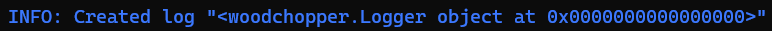
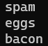
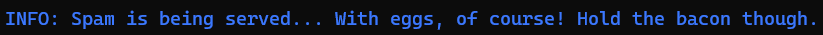

#  WoodChopper 

*A lightweight logging package*

### Table of contents
[Back to Top](#woodchopper)

[Table of contents](#table-of-contents)

[Installation](#installation)
- [Using `pip`](#using-pip)
	- [Unix/mac/linux:](#unixmaclinux)
	- [Windows:](#windows)

[Usage](#usage)
- [Creating a log](#creating-a-log)
- [Logging using the base `log` method](#logging-using-the-base-log-method)
- [Logging every item in a list or tuple](#Logging-every-item-in-a-list-or-tuple)
- [Logging verbose information](#Logging-verbose-information)
- [Logging non-critical errors](#Logging-non-critical-errors)
- [Logging critical errors](#Logging-critical-errors)
- [Deleting a log](#Deleting-a-log)

[Getting help](#getting-help)

## Installation
As of now, you can only use pip to install woodchopper. However, this may change in the near future

### Using `pip`
To install this package using pip, simply run the following command:

#### Unix/mac/linux:
```bash
pip3 install woodchopper
```


#### Windows:
```cmd
pip install encryptutils
```

## Usage

### Creating a log

Creating logs is easy. Just import the `Logger` class, make a new instance of it, optionaly passing a filepath for the log(str or Path), and assign the object to a variable, like so: 

```py
from woodchopper import Logger
from pathlib import Path

monty = Path("monty.log")
l = Logger(monty)
```

Output:



### Logging using the base `log` method

This works very much like `console.log` in JavaScript

```py
l.log("spam and eggs")
```


Output:


### Logging every item in a list or tuple

There is no equivalent for `log_list` in JavaScript

```py
l.log_list(["spam", "eggs", "bacon"])
```
Output:



### Logging verbose information
Like `console.info` in JavaScript

`loggingVerbose.py`
```py
l.info("Spam is being served... With eggs, of course! Hold the bacon though.")
```

Output:



### Logging non-critical errors
JavaScript definition: `console.warn`!

`loggingWarnings.py`
```py
l.warn("We\'re out of bacon!")
```

Output:


### Logging critical errors
JS equivalent: `console.error`.

```py
l.error("OUT OF SPAM! OUT OF SPAM!!!")
```

Output:


### Deleting a log

```py
l = None
```

Output:


## Getting help

You can get help regarding this package in many ways. If you need help with syntax, your first stop should always be help manuals, whether it's the GitHub wiki tab, man pages (not for packages though:wink:), or python's built-in help function[^1]. For errors, it should be [StackOverflow](https://stackoverflow.com) or the [bug tracker](https://github.com/TinkerTown-SEMI/woodchopper/issues).

Happy logging!


[^1]: Using the `help` function for woodchopper:
	```py
	from woodchopper import Logger
	from pathlib import Path

	l = Logger(Path("monty.log"))

	help(Logger)
	help(l)
	help(l.log)
	# And so on and so forth
	```
